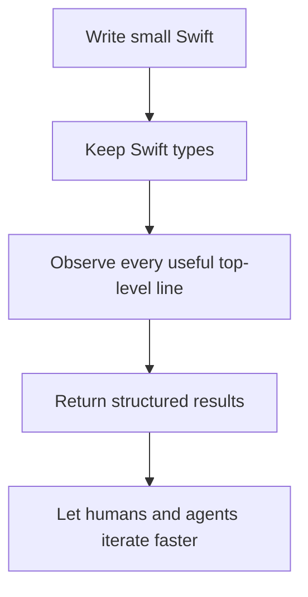

# snote Philosophy

`snote` exists to make small Swift thoughts observable without turning them into a project, a test, or a playground.

## Core Idea

## Principles

| Principle | Meaning |
|---|---|
| Swift first | The observed code runs as Swift, with Swift types, compiler diagnostics, and package context. |
| No `print` ceremony | Users write values. The tool records them. |
| Line results over final result | A scratchpad is useful because each meaningful line leaves evidence. |
| JSON is a product surface | Agent workflows need stable structured output, not scraped terminal text. |
| Fast enough now, faster later | The runner cache is the first step toward incremental and daemon-backed execution. |
| Tests remain tests | `snote` helps exploration; it does not replace formal test suites. |

## Design Boundaries

| Tool | Responsibility |
|---|---|
| `swift test` | Prove behavior with assertions |
| `swift repl` | Interactive evaluation |
| `#Playground` | Explicit playground-style blocks |
| `snote` | Batch scratchpad execution with line observations |
| `snote --json` | Machine-readable observation protocol |

The tool should stay boring at the command boundary and precise in its output. When a run fails, the failure should be visible as diagnostics that a person or an agent can act on.
