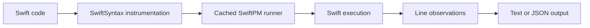

# snote

`snote` is a typed Swift scratchpad runner.

It evaluates small Swift snippets, files, or stdin input, records useful top-level lines, and prints either a compact human-readable result or a structured JSON report.

## Installation

```bash
brew install mint
mint install 1amageek/swift-note
```

Mint links installed executables into `~/.mint/bin` by default. Add it to your shell `PATH` if `snote` is not found after installation:

```bash
export PATH="$HOME/.mint/bin:$PATH"
```

For zsh, persist it with:

```bash
echo 'export PATH="$HOME/.mint/bin:$PATH"' >> ~/.zshrc
```

You can also run `snote` without linking it globally:

```bash
mint run 1amageek/swift-note snote '1 + 2'
```

## Quick Start

```bash
snote '1 + 2'
```

Output:

```text
1  3
```

The examples below use `snote` as the command name. If you are developing from a checkout instead of installing with Mint, run `swift build -c release` and use `.build/release/snote` from the package root.

## What It Does



| Mode | Command | Output |
|---|---|---|
| One-liner | `snote '1 + 2'` | Compact line result |
| Explicit eval | `snote -e 'let x = 10; x * 2'` | Compact line results |
| File | `snote path/to/file.swift` | Compact line results |
| Stdin | `snote --stdin` | Compact line results |
| JSON | `snote --json '1 + 2'` | Structured report |

## Output

Default output is optimized for reading in a terminal:

```bash
printf 'let x = 10\nx * 2\n' | snote --stdin
```

```text
1  x = 10
2  20
```

JSON output is the stable protocol for agents and tools:

```bash
snote --json '1 + 2'
```

```json
{
  "diagnostics": [],
  "exitCode": 0,
  "results": [
    {
      "kind": "expression",
      "line": 1,
      "name": null,
      "summary": "3",
      "type": "Int",
      "value": 3
    }
  ],
  "status": "succeeded"
}
```

## Supported Inputs

| Input | Behavior |
|---|---|
| `import` declarations | Preserved in the generated runner |
| Type and function declarations | Available to later top-level code |
| Top-level `let` / `var` bindings | Evaluated and observed |
| Top-level expressions | Evaluated and observed |
| `try` / `await` expressions | Evaluated inside an async entry point |
| File ranges | `--lines <start:end>` evaluates selected file lines |

## Package Context

Use `--package <path>` when the snippet should import local SwiftPM library products.

```bash
snote --package . -e 'import MyLibrary; makeValue()'
```

The generated runner is cached under `~/.snote/cache/`.

## Mint Usage

| Task | Command |
|---|---|
| Install Mint | `brew install mint` |
| Install `snote` | `mint install 1amageek/swift-note` |
| Run without global link | `mint run 1amageek/swift-note snote '1 + 2'` |
| Show installed path | `mint which 1amageek/swift-note snote` |
| List installed tools | `mint list` |
| Reinstall from the current branch or tag | `mint install 1amageek/swift-note --force` |
| Uninstall | `mint uninstall swift-note` |

Use a version, branch, or commit by appending it to the package reference:

```bash
mint install 1amageek/swift-note@main
mint run 1amageek/swift-note@main snote --json '1 + 2'
```

For a project-local tool definition, add a `Mintfile`:

```text
1amageek/swift-note@main
```

Then install the tools declared in that file:

```bash
mint bootstrap --link
snote '1 + 2'
```

## CLI

```text
Usage:
  snote -e <code>
  snote <file>
  snote --stdin

Options:
  -e, --eval <code>       Evaluate Swift code
  -f, --file <path>       Evaluate a Swift file
      --stdin             Read Swift code from stdin
      --json              Emit JSON output
      --watch             Re-run when the input file changes
      --lines <start:end> Evaluate a file line range
      --package <path>    Use a local SwiftPM package context
      --version           Print version
  -h, --help              Print help
```

## Development

```bash
xcodebuild test -scheme swift-note-Package -destination 'platform=macOS' -parallel-testing-enabled NO
```

The package uses Swift 6 mode and SwiftSyntax from the Swift 6.4 release branch.

## Related Documents

| Document | Purpose |
|---|---|
| [`SPEC.md`](SPEC.md) | Behavioral contract and JSON protocol |
| [`PHILOSOPHY.md`](PHILOSOPHY.md) | Design intent and boundaries |
