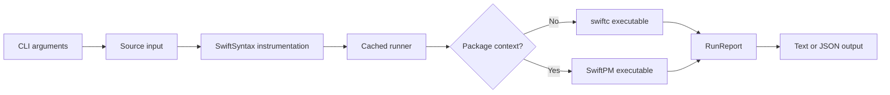

# snote Specification

`snote` is a typed Swift scratchpad runner. It accepts a one-liner, a Swift file, or stdin, instruments top-level Swift code, executes it through a cached runner, and returns line-by-line observations.

## User Contract

| Area | Requirement |
|---|---|
| Command | `snote <code>`, `snote <file>`, `snote --stdin`, `snote --json`, `snote --watch <file>` |
| Input | Swift top-level code with imports, declarations, `let` / `var` bindings, and expression statements |
| Eval line breaks | In eval code, `\n` outside Swift string literals is normalized to a source line break |
| Observation | Top-level `let` / `var` bindings and top-level expression statements are recorded in source order |
| Output | Human-readable text by default; JSON with `--json` |
| Runner | Plain snippets use a cached direct `swiftc` runner; `--package` uses a cached SwiftPM runner under `~/.snote/cache/` |
| Package context | `--package <path>` allows the generated runner to depend on local library products |
| Line range | `--lines <start:end>` evaluates a selected file range while preserving original line numbers |

## Data Flow

## JSON Protocol

The JSON output is the stable protocol for agents and tools.

| Field | Type | Meaning |
|---|---|---|
| `status` | string | `succeeded` or `failed` |
| `results` | array | Ordered observations |
| `diagnostics` | array | Compile, runtime, or tool diagnostics |
| `exitCode` | number | Process exit code represented by the report |

Each observation contains:

| Field | Type | Meaning |
|---|---|---|
| `line` | number | Source line |
| `kind` | string | `binding`, `expression`, or `error` |
| `name` | string or null | Binding name when available |
| `type` | string | Swift type summary |
| `value` | JSON value or null | Structured value when representable |
| `summary` | string | Human-readable value summary |

## MVP Scope

The current release targets top-level scratchpad workflows:

| Supported | Notes |
|---|---|
| `import` declarations | Preserved at the top of the generated runner |
| Type and function declarations | Emitted outside the generated entry point |
| `let` / `var` bindings | Emitted inside the generated entry point and observed after evaluation |
| Expression statements | Rewritten into temporary bindings and observed |
| `try` / `await` expressions | Evaluated inside an async entry point; thrown errors are reported as diagnostics |
| JSON values | Strings, booleans, numbers, optionals, arrays, sets, and string-keyed dictionaries are represented structurally when possible |

## Non-Goals For MVP

| Area | Position |
|---|---|
| Replacing `swift test` | `snote` observes values; tests remain the formal verification tool |
| Interactive REPL state | Each run is a deterministic batch execution |
| Full notebook semantics | Nested statements are not expanded into per-line observations in the MVP |
| Daemon runtime | The cache layout is daemon-ready, but the daemon command is not part of the MVP |
